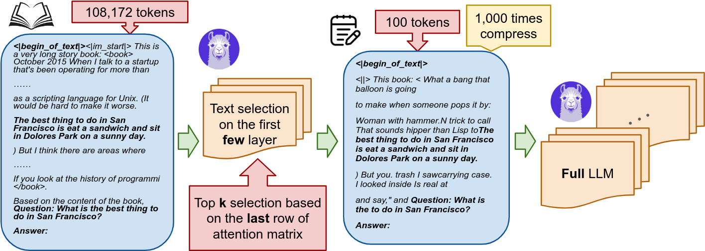
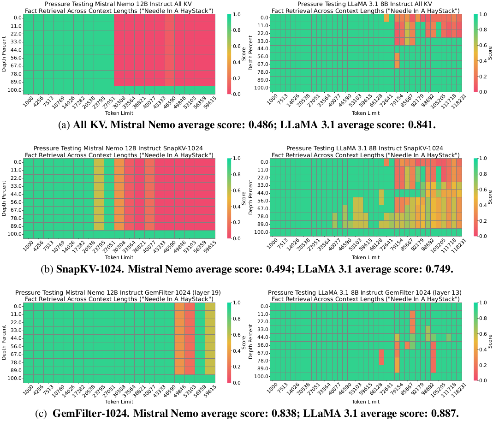
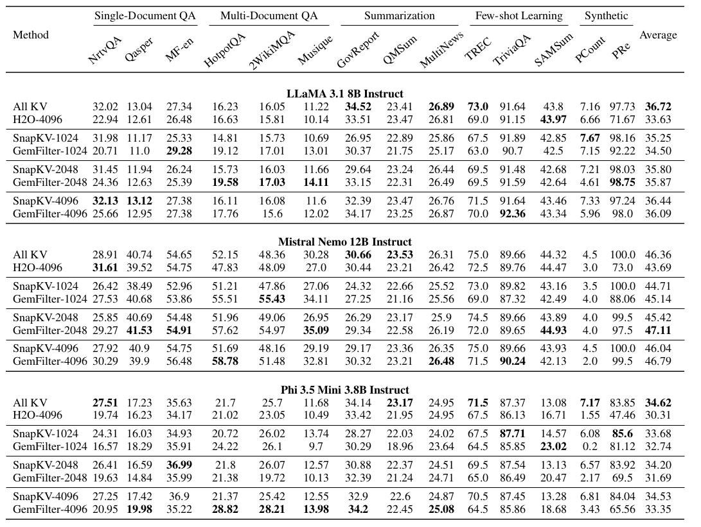
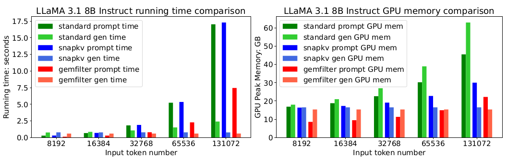

# GemFilter :gem:

This is an official PyTorch implementation of the paper with the title **Discovering the Gems in Early Layers: Accelerating Long-Context LLMs with 1000x Input Token Reduction**.

We propose an algorithm that uses early layers of an LLM as filters to select and compress input tokens, significantly reducing the context length for subsequent processing.

[[arXiv paper](https://arxiv.org/pdf/2409.17422)]



## Requirements

The code depends on Huggingface transformer 4.43.3 version.

```bash
transformers==4.43.3
flash-attn==2.6.3
```

## Installation

Check your correct [PyTorch](https://pytorch.org/) version.

```bash
git clone https://github.com/SalesforceAIResearch/GemFilter.git
cd GemFilter
conda create --name gemfilter python=3.12
conda activate gemfilter
pip install torch torchvision torchaudio 
pip install -r requirements.txt
python setup.py develop
```

## Quick Start

### Use GemFilter Method

```bash
python needle_eval.py\
 --model hf_model_id\
 --modified gemfilter\ 
 --topk 1024 \
 --ctx_len 32000
```

### Customize Your Models

GemFilter can be easily integrated with any transformer models. You can follow the comment marked with `[GemFilter]` to construct your own models.

The detailed algorithm of GemFilter is in [`gem_filter_utils.py`](./my_baseline/GemFilter/gem_filter_utils.py) and [`my_generation.py`](./my_utils/my_generation.py).

This repo supports four methods: GemFilter, SnapKV, H2O, and standard attention.

```python
parser.add_argument('--modified', type=str, default=None, \
    choices=['gemfilter', 'snapkv', 'h2o']) # None for standard attention
```

## Partial Results

### Needle-in-a-Haystack

Evaluate on [Needle-in-a-Haystack](https://github.com/gkamradt/LLMTest_NeedleInAHaystack) benchmark. See more details [here](./eval/needle).



### LongBench

Evaluate on [LongBench](https://github.com/THUDM/LongBench) benchmark. See more details [here](./eval/LongBench).



### Running Time and GPU Memory




## Citation

If you feel this project is helpful, please consider cite our paper :blush:

```
@article{smn+24,
 title={Discovering the Gems in Early Layers: Accelerating Long-Context LLMs with 1000x Input Token Reduction},
 author={Shi, Zhenmei and Ming, Yifei and Nguyen, Xuan-Phi and Liang, Yingyu and Joty, Shafiq},
 journal={arXiv preprint arXiv:2409.17422},
 year={2024}
}
```
